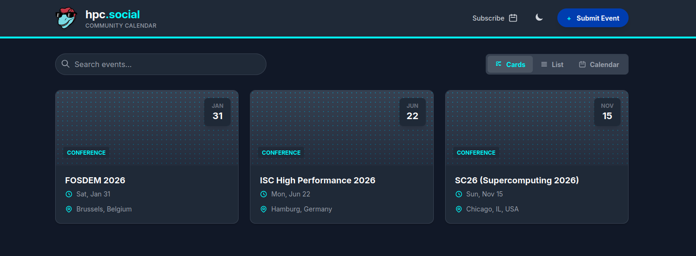
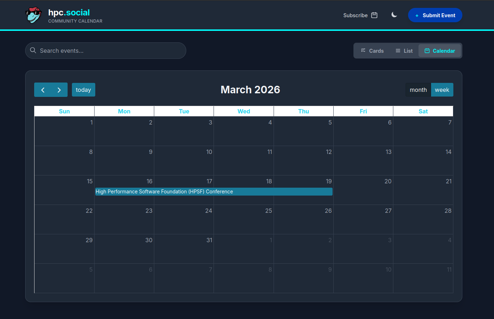

# hpc.social Events

Welcome to the hpc.social events calendars! Here we provide an events
calendar that is relevant for the HPC social community. 

- 📅 [HPC Social Events](https://hpc.social/events) 📅

Provide [feedback or discussion items](https://github.com/hpc-social/hpc-social.github.io/discussions/51) on the GitHub Discussions board.

## How does it work?

1. You can browse to the [events page](https://hpc.social/events) to see a calendar or listing.
2. Click on Submit Event to add a single event or feed.
3. View event details to add to your calendar or get more information.
4. A new event opens a GitHub issue, which a maintainer can apply the `approve-event` label to.
5. The addition of the label triggers automation to update the calendar.

## Views

The default is cards (shown above) but we also have listing:

And of course, a calendar!

All link to the same common events and details.

## Development

<a rel="me" href="https://mast.hpc.social/@events">Mastodon</a>
